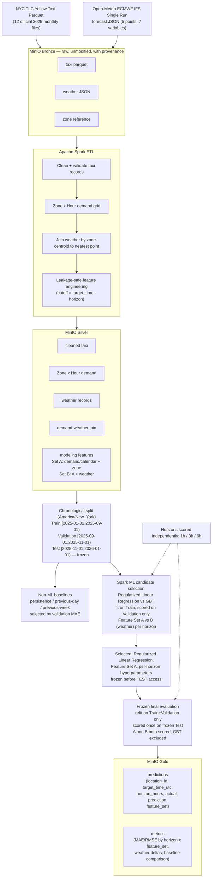

# Architecture and Data-Flow Diagram

Source format is Mermaid (renders natively on GitHub). No local Mermaid
renderer (`mmdc`) is installed in this environment, so no SVG/PNG export is
committed — only this version-controlled diagram source, per the project
rule against fabricating artifacts that were not actually produced.

## Key separations shown

- **Weather vs no-weather**: every stage from feature engineering onward
  carries Feature Set A (no weather) and Feature Set B (A + weather) as
  parallel populations sharing identical keys.
- **Train / Validation / frozen Test**: the split is fixed and chronological;
  Test is read only once, at the final evaluation stage, after the model
  family and hyperparameters were frozen from Validation-only selection.
- **1h / 3h / 6h horizons**: features, splits, baselines, model selection,
  and final evaluation are all computed and scored separately per horizon.
