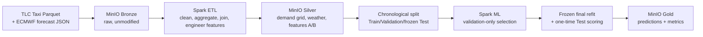

# Design Document — NYC Taxi Weather Demand Forecasting

## Problem and research question

Can weather information improve short-term NYC taxi demand forecasting, and
how does its predictive value change across 1-hour, 3-hour, and 6-hour
horizons? The target is hourly `pickup_count` per NYC Taxi Zone, for the
74-zone set covering 95.09% of 2025 five-borough pickups.

## Data sources

- **NYC TLC Yellow Taxi** trip records, calendar year 2025 — 12 official
  monthly Parquet files (`d37ci6vzurychx.cloudfront.net/trip-data`) plus the
  official Taxi Zone lookup/geographic reference.
- **Open-Meteo ECMWF IFS Single Runs** forecast JSON — five fixed NYC
  points, seven variables (`temperature_2m`, `relative_humidity_2m`,
  `precipitation`, `snowfall`, `weather_code`, `wind_speed_10m`,
  `wind_gusts_10m`), acquired with a six-hour publication lag so only
  information available before each target hour is used (never observed
  weather, to avoid ex-post leakage).

## Data flow

Full diagram with all Silver sub-outputs, baselines, and horizon/A-B
branching: `docs/architecture_diagram.md`.

## Technologies

Apache Spark 3.5.7 (standalone, Docker Compose) performs every meaningful
transformation — cleaning, aggregation, joins, feature engineering,
chronological splitting, baseline scoring, model training, and final
evaluation. MinIO (S3-compatible) is the Bronze/Silver/Gold object store,
satisfying the required Big Data storage technology; Elasticsearch/Kibana
were evaluated and excluded as adding no demonstrated value to the research
question (see `DATA_DECISIONS.md`). PySpark ML (`LinearRegression`,
`GBTRegressor`) trains and selects models.

## AI capability

Two feature sets share 14 leakage-safe predictors computed strictly from
information at or before cutoff `t-h`: 9 demand-history features (cutoff
and lagged demand, previous-day/week same-hour demand, trailing means,
trailing 24h standard deviation), 4 calendar features (hour, day-of-week,
weekend flag, month), and Taxi Zone identity (`location_id`). **Feature set
A** is these 14 columns; **feature set B** adds the seven approved weather
variables plus missingness indicators. No imputation is performed anywhere.

Three non-ML baselines (persistence, previous-day, previous-week seasonal
naive) were scored on a fixed chronological validation split; previous-week
was selected by validation MAE (15.122268) alone. Two model families
(Regularized Linear Regression, Gradient-Boosted Trees) with small
predeclared grids were then trained on train only and scored on validation
only, per horizon and feature set. Regularized Linear Regression on feature
set A was selected at every horizon and its configuration frozen *before*
any TEST access. It was refit on train+validation only and scored exactly
once on the frozen TEST partitions, with model family, features, and
hyperparameters unchanged throughout.

## Final result

| Horizon | Feature set | TEST MAE | TEST RMSE |
|---|---|---:|---:|
| 1h | A / B | 13.789029 / 13.775351 | 24.889088 / 24.882623 |
| 3h | A / B | 17.476389 / 17.474982 | 33.478442 / 33.467007 |
| 6h | A / B | 18.350151 / 18.369958 | 35.703538 / 35.706288 |

Feature set A beats the frozen previous-week baseline (TEST MAE 20.969355 /
20.996511 / 21.009413) at every horizon. Weather's measured effect is small
and sign-inconsistent (+0.099%, +0.008%, −0.108% MAE change at 1h/3h/6h),
consistent with the negative validation-time deltas (−0.18% to −1.13%):
**weather adds no material, reliable incremental predictive value** over
demand/calendar/zone features in this experiment, at any horizon.

## Key trade-offs and limitations

- **MinIO only, no Elasticsearch/Kibana** — satisfies the storage
  requirement with less operational complexity; not justified by the
  research question.
- **Chronological, non-random splits and no imputation** — protects
  temporal validity and preserves real data gaps as evidence, at the cost
  of variance and a smaller paired-evaluation population.
- **Forecast (not observed) weather** with a conservative six-hour lag
  approximates, but does not exactly reproduce, true operational forecast
  availability.
- **One calendar year (2025)** limits exposure to inter-annual variability;
  the 74-zone, 95%-coverage scope excludes low-volume zones entirely; 2025
  DST transition hours are quarantined (excluded), not imputed.
- **Small predeclared hyperparameter grids and Linear Regression only at
  TEST** avoid overfitting to validation through tuning, at the cost of
  potentially leaving nonlinear spatial-temporal signal unexploited.
